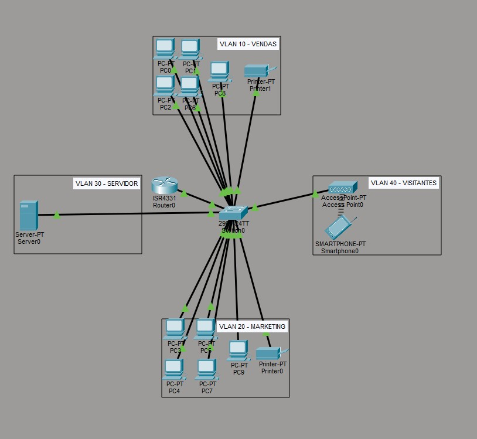

# 🏢 Projeto acadêmico de Infraestrutura de Redes Corporativas (TecnoLink)

[](https://www.netacad.com/courses/packet-tracer)
[](#)

Este repositório contém o design e a configuração completa de uma rede local (LAN) construída do zero para uma startup fictícia (TecnoLink), projetada no Cisco Packet Tracer. O foco do projeto é garantir alta disponibilidade, performance para tráfego multimídia e **segurança através de segregação de tráfego**.

## 🎯 O Desafio
A TecnoLink necessitava de uma infraestrutura para atender 15 colaboradores divididos em departamentos, além de visitantes. Os requisitos principais incluíam:
- Isolamento de tráfego entre departamentos por questões de segurança.
- Rede sem fio dedicada e isolada para visitantes.
- Infraestrutura de servidores e impressão centralizada com IPs fixos.

## 🗺️ Topologia da Rede



## 🛠️ Tecnologias e Protocolos Utilizados
* **VLANs (802.1Q):** Segmentação lógica em Camada 2 para redução de domínio de broadcast e aumento de segurança.
* **Router-on-a-Stick:** Roteamento Inter-VLAN na Camada 3 utilizando subinterfaces.
* **DHCP (Dynamic Host Configuration Protocol):** Escopos configurados no roteador central para distribuição dinâmica de IPs para os endpoints (PCs e Smartphones).
* **ACL (Access Control Lists):** Políticas de firewall de borda interna para bloquear o acesso não autorizado de visitantes à rede corporativa.

## 📊 Arquitetura de Endereçamento IP

A rede foi dividida em quatro domínios principais:

| Departamento | VLAN ID | Endereço de Rede | Gateway Padrão | Atribuição de IP |
| :--- | :---: | :--- | :--- | :--- |
| **Vendas** | 10 | `192.168.10.0/24` | `192.168.10.1` | DHCP |
| **Marketing** | 20 | `192.168.20.0/24` | `192.168.20.1` | DHCP |
| **Servidores** | 30 | `192.168.30.0/24` | `192.168.30.1` | Estático |
| **Visitantes (Wi-Fi)**| 40 | `192.168.40.0/24` | `192.168.40.1` | DHCP |

> **Nota Arquitetural:** O link de *uplink* entre o Switch Layer 2 e o Roteador foi estabelecido através de portas **GigabitEthernet** configuradas em modo *Trunk*, garantindo largura de banda suficiente para o tráfego agregado de todas as VLANs.

---

## 🧪 Testes e Validação

### 1. Roteamento Inter-VLAN (Router-on-a-Stick)
Para comprovar a comunicação entre setores diferentes, foi realizado um teste de conectividade (Ping) partindo do PC de Vendas (VLAN 10) com destino à Impressora de Marketing (VLAN 20). O sucesso nas respostas demonstra que o tráfego está sendo roteado corretamente pelo gateway central, comprovando a eficácia da arquitetura.

.png)

### 2. Segurança de Borda (Firewall Interno com ACL)
Para garantir que a rede de visitantes (VLAN 40) não tenha acesso aos dados sensíveis da empresa, foi implementada uma ACL Estendida no Roteador, aplicada no tráfego de entrada (`in`) da subinterface `g0/0/0.40`.

```text
! Fragmento da configuração de segurança no Roteador
access-list 100 deny ip 192.168.40.0 0.0.0.255 192.168.10.0 0.0.0.255
access-list 100 deny ip 192.168.40.0 0.0.0.255 192.168.20.0 0.0.0.255
access-list 100 deny ip 192.168.40.0 0.0.0.255 192.168.30.0 0.0.0.255
access-list 100 permit ip any any
